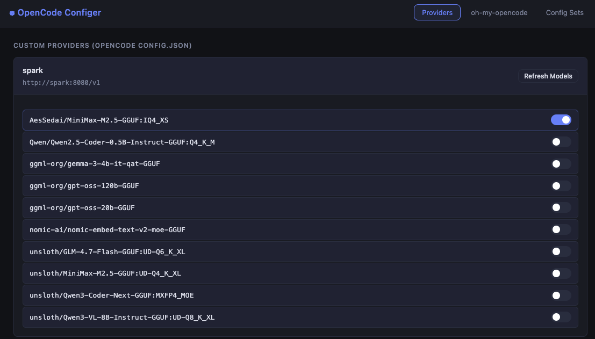

# opencode-configer

Web UI for managing [opencode](https://opencode.ai) and [oh-my-opencode](https://github.com/lalalune/oh-my-opencode) configuration pairs.



## Install

```bash
uv tool install git+https://github.com/eleqtrizit/oh-my-opencode-configurator
```

## Usage

```bash
opencode-configer
```

Opens a local web UI at `http://127.0.0.1:7420` (or the next available port).

### Options

| Flag | Default | Description |
|------|---------|-------------|
| `--host` | `127.0.0.1` | Host to bind the server to |
| `--port` | `0` (auto) | Port to listen on |
| `--no-browser` | `false` | Skip opening the browser |
